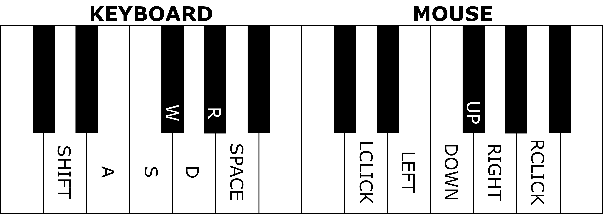

# MIDIator: The MIDI-Input Mediator

MIDIator allows you to utilize your MIDI devices as keyboard and mouse inputs for Windows systems. Just plug in your MIDI device, find its name, edit a configuration value, and go!


The inspiration for this project came from wanting to play an FPS with my MIDI keyboard -- with MIDIator, not only can you play games with your piano, but you can use your piano as a general input device for Windows.

## Quickstart

### Installing and Running MIDIator

Follow the steps below to install and run MIDIator with your MIDI device:

```bash
# Install dependencies (mido and python-rtmidi)
py -m pip install -r requirements.txt

# Plug in your MIDI device
# Go to "Device Manager" -> "Sound, video and game controllers" to find its name
# Set "identifier" in the configuration block of src/midiator.py to the device's name 

# Start midiator
py midiator.py
```

### Default Keybinds

The below diagram shows the default key- and mouse-binds for MIDIator, starting at C3 and going up to B4.

***Note:*** These keybinds do not account for the Ctrl, Q, nor E keys, nor the scroll wheel.



## Features

### Low-level input handling

When you run MIDIator, your piano effectively becomes a direct input device for keyboard and mouse events -- this includes alt-tabbing, opening the start menu, and so on (i.e. MIDIator does not restrict interactivity to just the foreground process).

Anything you can do with a keyboard and mouse, you can do with MIDIator, since the events generated by MIDIator are fed to Windows at a low level (see `src/windows/windows_io.py` for details).

### Customizable key/mouse bindings

MIDIator has no configuration file. Instead, check out the user configuration block of the `midiator.py` file, and you'll find some dictionaries that look like the following:

```python3
    # Map from MIDI key codes to DirectInput key codes
    # Note: "S" in a note name signifies "#" or "sharp"
    default_key_binds = {
        Notes.FS3: DICodes.W,
        Notes.E3: DICodes.A,
        Notes.F3: DICodes.S,
        Notes.G3: DICodes.D,
        ...
```

On the left you'll see the name of the note on the piano you'd like to bind, and on the right you'll see the name of the key you'd like to bind. The names of notes and keys can be found in `src/midi/midi_enums.py` and `src/windows/windows_enums.py` files, respectively, although they should be largely intuitive. This goes for mouse button and movement binds as well (found in `src/windows/windows_enums.py`).

### Useful default output

By default, MIDIator runs in verbose mode, which displays initialization information as well as the MIDI key code, note name, and corresponding binding for every keypress. This information is especially useful for debugging why a keybind may not be working as expected.

Here's a sample of some of the output:

```
{+} Initializing MIDIator...
    > Connecting to MIDI controller by identifier "Casio"... Done.
    > Initialization complete. 
{+} Spawning mouse handler thread... Done.
{+} Handling MIDI events...
    > Received MIDI code 38 (D3 ) -> Key LSHIFT
    > Received MIDI code 42 (FS3) -> Key W
    > Received MIDI code 50 (D4 ) -> Mouse LEFT_CLICK
    > Received MIDI code 55 (G4 ) -> Mouse RIGHT
    > Received MIDI code 45 (A3 ) -> Key SPACE
```

### Compatible with any MIDI keyboard (theoretically)

You *should* be able to use MIDIator with whatever MIDI device you'd like, on the condition that it sends out stsandard MIDI keyboard codes. MIDIator was tested with a Casio keyboard, but MIDI key codes should be universal. In the case that the binds don't work as expected, MIDIator will let you know what note it thinks your pressing (provided that verbose mode is enabled).

If you use MIDIator with a non-keyboard device (e.g. an MPC) there's no guarantee of functionality; however, if it works I'd love to hear about it!

## Issues, Upcoming Features, and Contributing

This project will probably remain dormant; however, any features I'd like to add or known bugs will be enumerated in the [Issues](https://github.com/ajstensland/MIDIator/issues) area. I don't expect many people to make it to this part of the README, but if there's an issue you'd like fixed or a feature you'd like added make an issue at the previous link.
